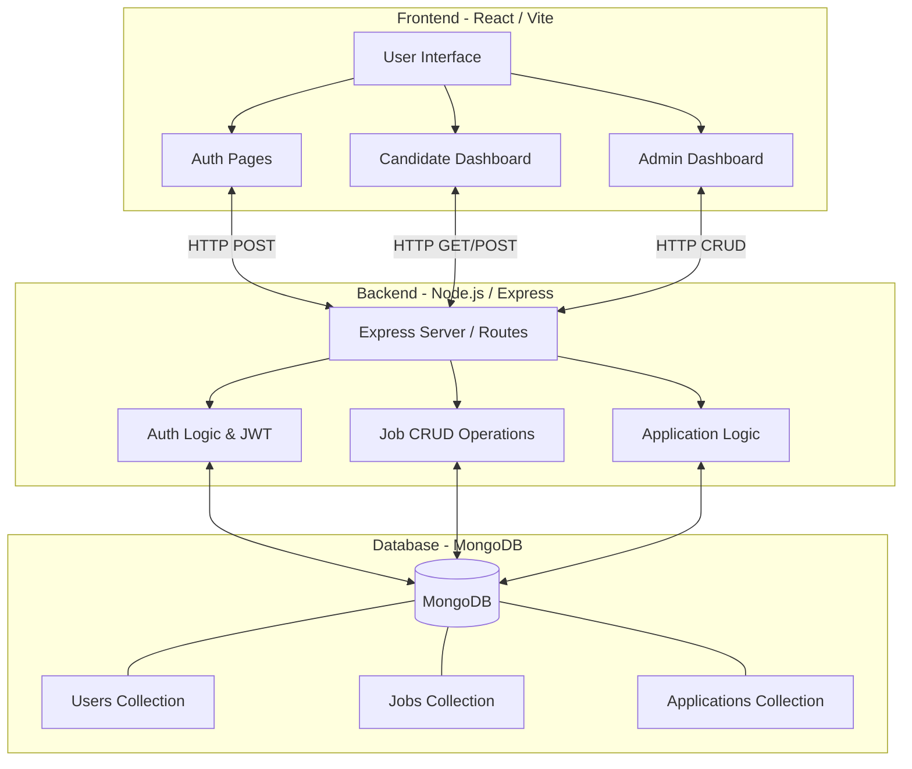

# Job Portal Platform

A full-stack, comprehensive Job Portal application designed to connect candidates with employers seamlessly. This solution includes robust search capabilities, candidate profiles, and an administrative dashboard to manage job postings and applications.

## 🚀 Features

### For Candidates
*   **User Registration & Authentication**: Secure sign-up and login utilizing JWT.
*   **Job Discovery**: Browse and search active job listings with responsive UI.
*   **Detailed Job Views**: Read complete job descriptions, requirements, and salaries.
*   **Application Tracking**: Apply to jobs and view the status of past applications.
*   **User Profiles**: Manage personal information and resumes.

### For Administrators/Employers
*   **Admin Dashboard**: Overview of system statistics (active jobs, total applicants).
*   **Job Management**: Create, edit, and delete job postings.
*   **Application Management**: View candidates who applied to specific roles.
*   **Candidate Review**: Access applicant profiles.

## 🛠️ Tech Stack

**Frontend:**
*   React 18 (with Vite)
*   Tailwind CSS (for responsive and quick styling)
*   Framer Motion (for smooth micro-animations)
*   React Router DOM (client-side routing)
*   Axios (HTTP client)

**Backend:**
*   Node.js & Express.js (RESTful API)
*   MongoDB & Mongoose (NoSQL Database)
*   JWT & bcryptjs (Authentication and security)

---

## 🏗️ System Architecture

Below is a high-level representation of how the platform operates:



---

## 📂 Project Structure

```text
CI-Indeed-JP/
├── backend/
│   ├── src/
│   │   ├── config/       # Database and environment configurations
│   │   ├── controllers/  # Request handlers (Auth, Jobs, Apps)
│   │   ├── middleware/   # Authentication and validation checks
│   │   ├── models/       # Mongoose Schemas definitions
│   │   ├── routes/       # Express router definitions
│   │   └── server.js     # Express app entry point
│   └── package.json
│
└── frontend/
    ├── public/
    ├── src/
    │   ├── api/          # Axios interceptors and API calls
    │   ├── components/   # Reusable UI components (Navbar, Footers, Cards)
    │   ├── pages/        # Route pages (Landing, AdminDashboard, Jobs...)
    │   ├── App.jsx       # Main React component
    │   └── main.jsx      # React DOM rendering entry
    └── package.json
```

---

## ⚙️ Local Setup & Installation

Follow these steps to get the project working locally on your machine.

### Prerequisites
*   Node.js installed
*   MongoDB installed locally or a MongoDB Atlas URI

### 1. Clone the repository
```bash
git clone https://github.com/your-username/your-repo-name.git
cd CI-Indeed-JP
```

### 2. Backend Setup
Navigate to the backend directory, install packages, and set up your `.env` file.
```bash
cd backend
npm install
```
Create a `.env` file in the `backend/` root directory and add:
```env
PORT=5000
MONGO_URI=your_mongodb_connection_string
JWT_SECRET=your_jwt_secret_key
```

Run the backend server:
```bash
# For development with auto-restart
npm run dev

# For production
npm start
```

### 3. Frontend Setup
Open a new terminal, navigate to the frontend directory, and run the app.
```bash
cd frontend
npm install
```

Start the Vite development server:
```bash
npm run dev
```

Your application should now be running! The frontend usually runs on `http://localhost:5173` and the backend on `http://localhost:5000`.

---
*Built with ❤️ for a seamless hiring experience.*
